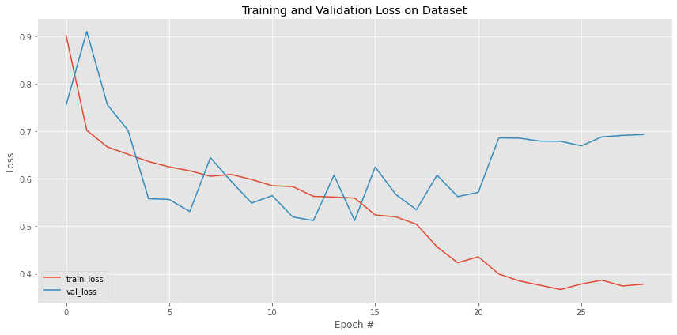
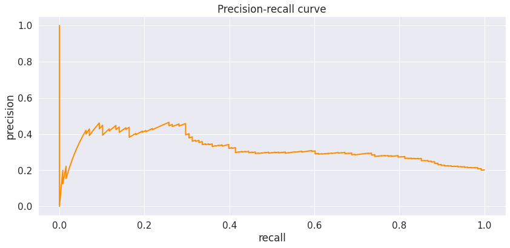
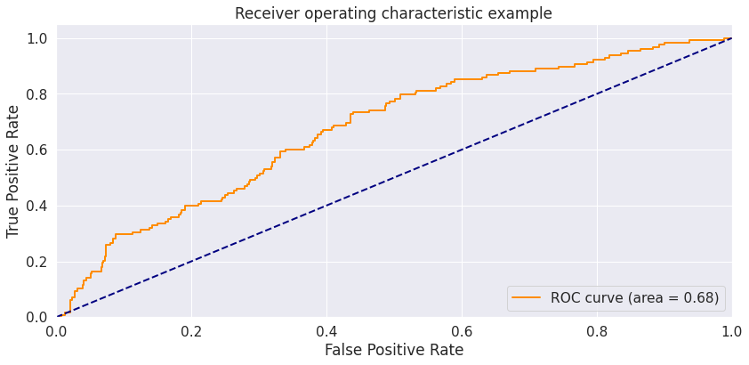
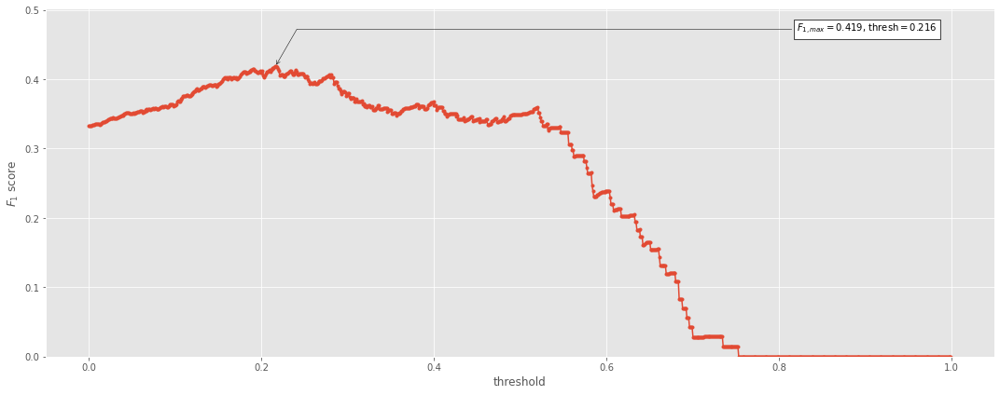
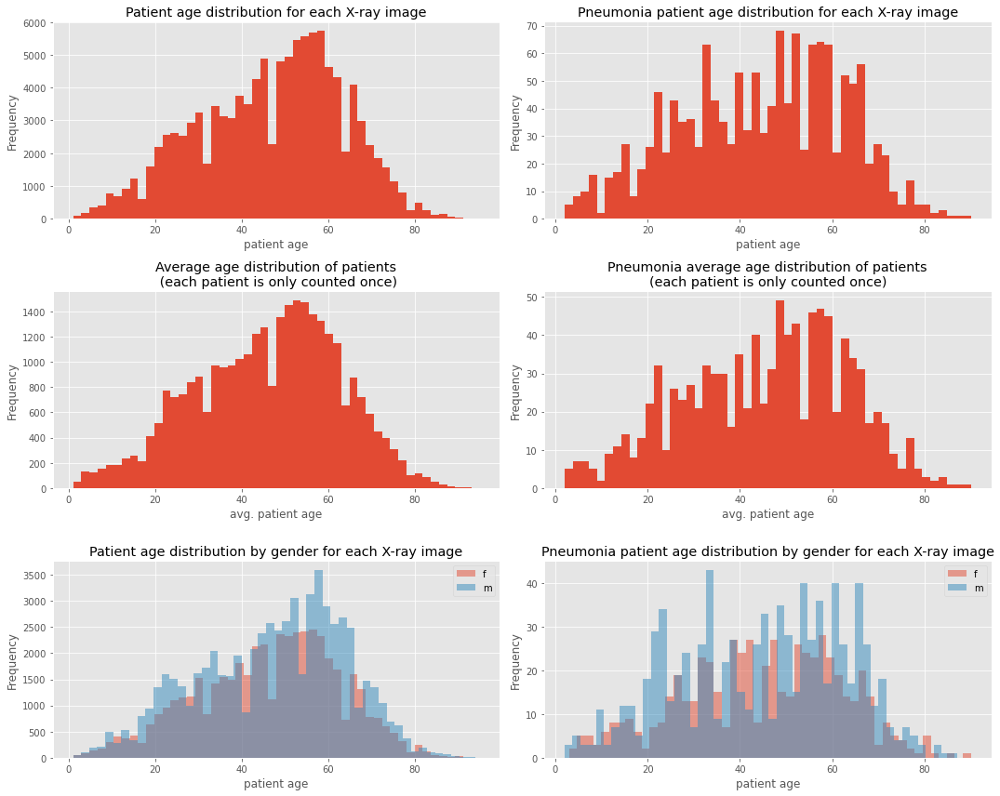
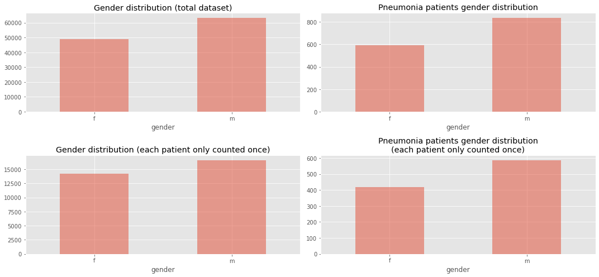
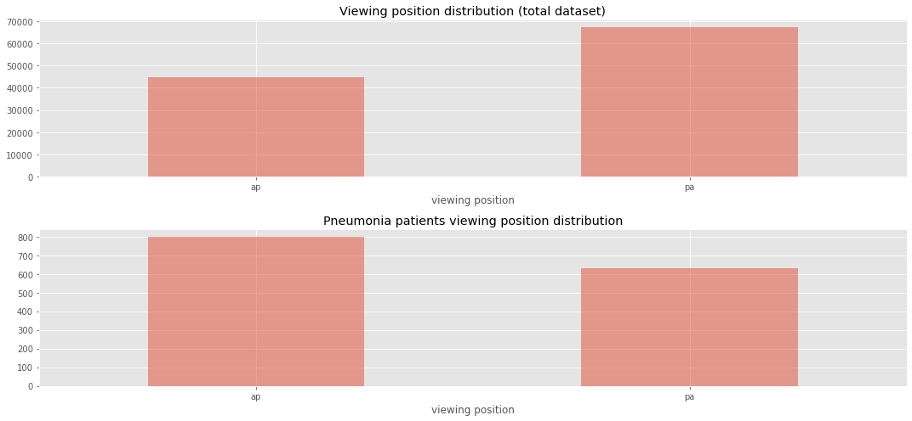
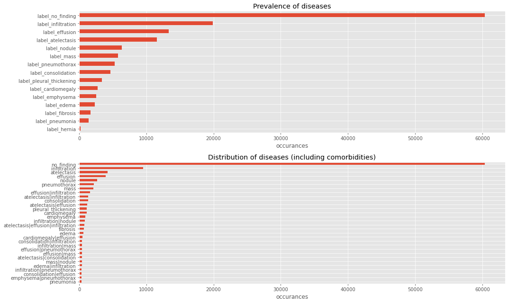
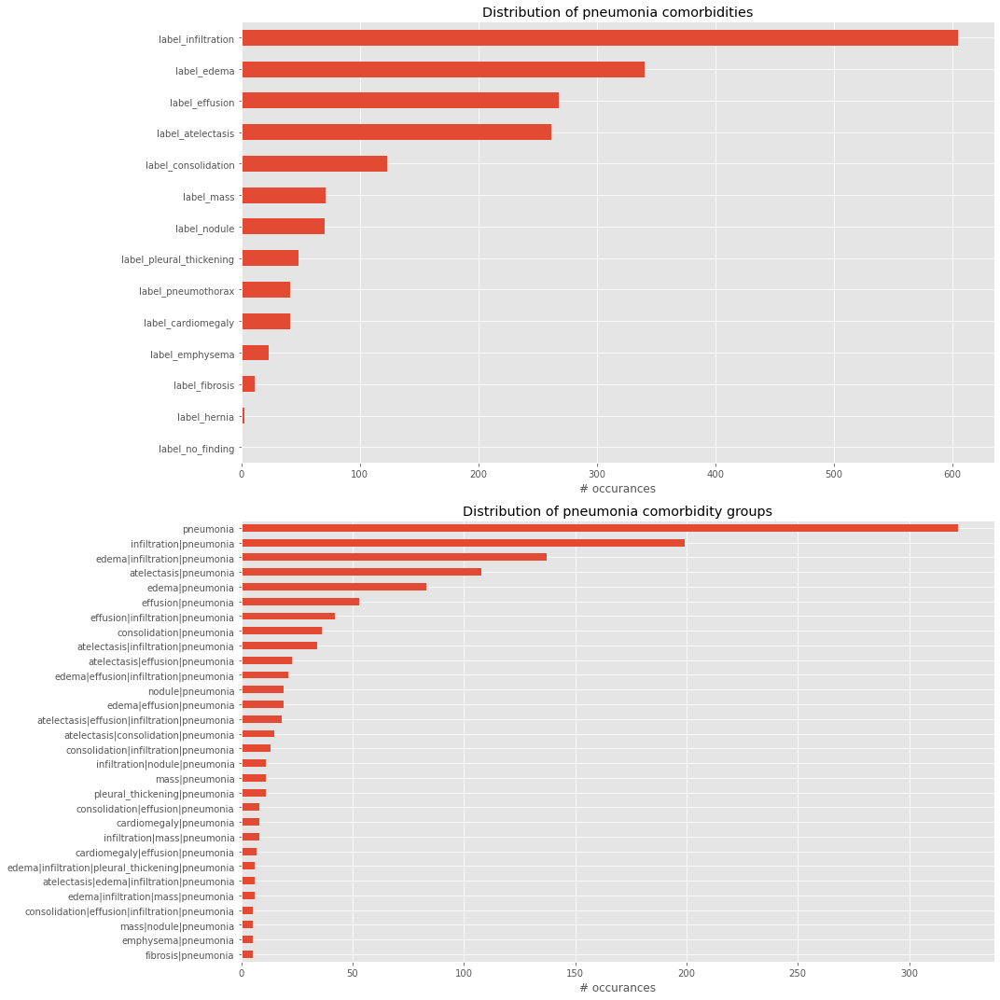

# Pneumonia Detection from Chest X-Rays

## Running the scripts:
Execution order:
1. eda.ipynb
2. model.ipynb
3. inference.ipynb

## Overview

A CNN is trained on the NIH Chest X-ray Dataset to classify a given chest x-ray for the presence or absence of pneumonia. The goal is to create a ML system that can predict the presence of pneumonia with human radiologist-level accuracy that could be prepared for submission to the FDA for 510(k) clearance as software as a medical device.

The dataset contains 112,000 chest x-ray images with disease labels acquired from 30,000 patients with clinical labels for each image that were extracted from radiology reports. 

## Pneumonia and X-Rays in the Wild

Chest X-ray exams are one of the most frequent and cost-effective types of medical imaging examinations. Deriving clinical diagnoses from chest X-rays can be challenging, however, even by skilled radiologists. 

When it comes to pneumonia, chest X-rays are the best available method for diagnosis. More than 1 million adults are hospitalized with pneumonia and around 50,000 die from the disease every year in the US alone. The high prevalence of pneumonia makes it a good candidate for the development of a deep learning application for two reasons: 1) Data availability in a high enough quantity for training deep learning models for image classification 2) Opportunity for clinical aid by providing higher accuracy image reads of a difficult-to-diagnose disease and/or reduce clinical burnout by performing automated reads of very common scans. 

The diagnosis of pneumonia from chest X-rays is difficult for several reasons: 
1. The appearance of pneumonia in a chest X-ray can be very vague depending on the stage of the infection
2. Pneumonia often overlaps with other diagnoses
3. Pneumonia can mimic benign abnormalities

For these reasons, common methods of diagnostic validation performed in the clinical setting are to obtain sputum cultures to test for the presence of bacteria or viral bodies that cause pneumonia, reading the patient's clinical history and taking their demographic profile into account, and comparing a current image to prior chest X-rays for the same patient if they are available. 

## About the Dataset

The NIH Chest X-ray dataset was curated by the NIH specifically to address the problem of a lack of large x-ray datasets with ground truth labels to be used in the creation of disease detection algorithms. 

The data can be downloaded from the [kaggle website](https://www.kaggle.com/nih-chest-xrays/data).

There are 112,120 X-ray images with disease labels from 30,805 unique patients in this dataset. The disease labels were created using Natural Language Processing (NLP) to mine the associated radiological reports. The labels include 14 common thoracic pathologies: 
- Atelectasis 
- Consolidation
- Infiltration
- Pneumothorax
- Edema
- Emphysema
- Fibrosis
- Effusion
- Pneumonia
- Pleural thickening
- Cardiomegaly
- Nodule
- Mass
- Hernia 

The biggest limitation of this dataset is that image labels were NLP-extracted so there could be some erroneous labels but the NLP labeling accuracy is estimated to be >90%.

The original radiology reports are not publicly available but you can find more details on the labeling process [here](https://arxiv.org/abs/1705.02315).

### Dataset Contents: 

1. 112,120 frontal-view chest X-ray PNG images in 1024*1024 resolution
2. Meta data for all images (Data_Entry_2017.csv): Image Index, Finding Labels, Follow-up #,
Patient ID, Patient Age, Patient Gender, View Position, Original Image Size and Original Image
Pixel Spacing.

## Project Steps

### 1. Exploratory Data Analysis

The file eda.ipynb contains the exploratory data analysis (EDA) of the dataset to understand and describe the content and nature of the data.

Some analysis done during EDA: 

* The patient demographic data such as gender, age, patient position,etc. (as it is available)
* The x-ray views taken (i.e. view position)
* The number of cases including: 
    * number of pneumonia cases,
    * number of non-pneumonia cases
* The distribution of other diseases that are comorbid with pneumonia
* Number of disease per patient 
* Pixel-level assessments of the imaging data for healthy & disease states of interest (e.g. histograms of intensity values) and compare distributions across diseases.

### 2. Building and Training the CNN Model

**Training and validating Datasets**

From your findings in the EDA component of this project, curate the appropriate training and validation sets for classifying pneumonia. Be sure to take the following into consideration: 

* Distribution of diseases other than pneumonia that are present in both datasets
* Demographic information, image view positions, and number of images per patient in each set
* Distribution of pneumonia-positive and pneumonia-negative cases in each dataset

**Model Architecture**

reasonable choice would be using the VGG16 architecture with weights trained on the ImageNet dataset. Fine-tuning can be performed by freezing your chosen pre-built network and adding several new layers to the end to train, or by doing this in combination with selectively freezing and training some layers of the pre-trained network. 

**Image Pre-Processing and Augmentation** 

You may choose or need to do some amount of preprocessing prior to feeding imagees into your network for training and validating. This may serve the purpose of conforming to your model's architecture and/or for the purposes of augmenting your training dataset for increasing your model performance. When performing image augmentation, be sure to think about augmentation parameters that reflect real-world differences that may be seen in chest X-rays. 

**Training** 

In training your model, there are many parameters that can be tweaked to improve performance including: 
* Image augmentation parameters
* Training batch size
* Training learning rate 
* Inclusion and parameters of specific layers in your model 

You will be asked to provide descriptions of the methods by which given parameters were chosen in the final FDA documentation.

 **Performance Assessment**

As you train your model, you will monitor its performance over subsequence training epochs. Choose the appropriate metrics upon which to monitor performance. Note that 'accuracy' may not be the most appropriate statistic in this case, depending on the balance or imbalance of your validation dataset, and also depending on the clinical context that you want to use this model in (i.e. can you sacrafice high false positive rate for a low false negative rate?)

 __Note that detecting pneumonia is *hard* even for trained expert radiologists, so you should *not* expect to acheive sky-high performance.__ [This paper](https://arxiv.org/pdf/1711.05225.pdf) describes some human-reader-level F1 scores for detecting pneumonia, and can be used as a reference point for how well your model could perform.

### 3. Clinical Workflow Integration 

The imaging data provided to you for training your model was transformed from DICOM format into .png to help aid in the image pre-processing and model training steps of this project. In the real world, however, the pixel-level imaging data are contained inside of standard DICOM files. 

For this project, create a DICOM wrapper that takes in a standard DICOM file and outputs data in the format accepted by your model. Be sure to include several checks in your wrapper for the following: 
* Proper image acquisition type (i.e. X-ray)
* Proper image acquisition orientation (i.e. those present in your training data)
* Proper body part in acquisition

## Results in form of a FDA Submission

****Name of Device:**** PneumoniaXNet

### Algorithm Description

#### General Information

##### Intended Use Statement

Assisting radiologists in the detection of pneumonia on X-ray chest images.
It is explicitly stated that the AI based algorithm PneumoniaXNet is intended to be used under the supervision of an expert like a radiologist or other clinician with expert knowledge.

##### Indications for Use

Automated detection of pneumonia from chest X-rays in non-emergency clinical settings.
The device PneumoniaXNet is intended to use as a diagnostic tool if the following conditions are fullfilled:

-   Predictions on male and female patients (see figure [55](#orgc6affff) for data distribution) between the ages of about 10 to 90 years (see figure [54](#orge265e84) for data distribution).
-   Chest X-ray view positions: posteroanterior (PA) view and/or erect anteroposterior (AP) chest view (see figure [56](#org9c00f37) for data distribution).
-   Optionally (on rare occasions): Analysing chest X-rays in regions with inadequate access to diagnostic imaging specialists.
    Getting a rough idea of the disease of a patient is better than nothing.

Description of a possible clinical setting:

-   Obtaining X-ray image of a patient&rsquo;s chest (PA or AP view).
-   Sending scan in DICOM format to a remote server with installed PneumoniaXNet software for processing.
-   Checking the DICOM file for compatibility (see [1.2.1](#org46dd1b7)).
-   If the scan passes the compatibility check it is preprocessed (see [1.2.2](#org927a6c0)).
-   Feed the X-ray image into the machine learning algorithm PneumoniaXNet.
-   The PneumoniaXNet classifier will output one of two diagnostical predictions: patient has pneumonia (1) or patient has no pneumonia (0).
-   The result is sent to a radiologist who will validate the result and compile a final diagnosis.

##### Device Limitations

-   The PneumoniaXNet device does not achieve 100% accuracy.
    Therefore it is advised that this classifiers predictions are only used as a supplementary diagnosis tool.
    The final diagnosis should always be compiled by an expert like a radiologist.
-   PneumoniaXNet should be run on a CUDA capable GPU (e.g. local server or cloud server with GPU access).
    This is especially important if the algorithm is used in situations where getting a result quickly is important

##### Clinical Impact of Performance

-   Enhancing workflow by providing fast and reliable pneumonia detection from X-ray images
-   If algorithm predicts a positive pneumonia case, a radiologist can prioritize to analyse this case more urgently.
    The patient could be treated sooner.
-   It is strongly recommended that the device is used as an assisting device for an imaging specialist.
    If the algorithm predicts a false positive (FP) the radiologist can always intervene and prevent a patient from a useless pneumonia treatment.
    The only downside of a false positive should be some wasted time.
    If the algorithm predicts a false negative (FN) this could lead to a loss of time for the patient&rsquo;s treatment.
    A trained radiologist should detect the pneumonia disease in this sirious case.
    False negatives are much more severe than false positives.
    Therefore the PneumoniaXNet device tries to prevent false negatives by adjusting the classifier threshold (see section [1.3.2](#orga11401f)).

#### Algorithm Design and Function

.")

##### DICOM Checking Steps

Before a DICOM file is preprocessed and fed to the PneumoniaXNet algorithm it is checked if it contains the correct properties. The following things are checked:

-   Modality must be &rsquo;DX&rsquo;.
-   Body part must be &rsquo;chest&rsquo;.
-   Patient position must be &rsquo;PA&rsquo; or &rsquo;AP&rsquo;.

##### Preprocessing Steps

The following preprocessing steps are performed on each image before it is fed into the PneumoniaXNet algorithm:

-   resizing image to spatial size 224x224 pixels
-   convert image from grayscale to RGB with dimensions 1x224x224x3 (the first dimension is the batch size, multiple images can be fed simultaneously in batches into the algorithm)
-   DenseNet121 specific preprocessing steps: input pixel values are scaled between 0 and 1 and each channel is normalized with respect to the ImageNet dataset

##### CNN Architecture

describe the architecture of the classifier
We use the Keras implementation of the DenseNet121 model as base model.
We cut the last few (dense) layers of the net and replace them with the following additional layers:

-   Global average pooling layer
-   dense layer with 1024 neurons and ReLu activation with dropout 0.5
-   dense layer with 512 neurons and ReLu activation with dropout 0.5
-   dense layer with 256 neurons and ReLu activation
-   dense layer with 1 neuron and sigmoid activation (output layer)

We freeze all trainable parameters of the base net except of the parameters of the last 7 layers.
These parameters in addition to the parameters of the additional layers above sum up to the trainable parameters.
In total we have 1,872,129 trainable parameters.
This so called transfer learning is a common and efficient way of training convolutional neural networks.
The imported DenseNet121 model has previously been trained on the ImageNet dataset.

#### Algorithm Training

##### Parameters used for training:

-   Batch size: 16 images
-   Optimizer learning rate: Adam optimizer with initial learning rate of 0.001
-   image augmentation used during training:
    -   horizontal flip: useful because we have X-ray images from both viewing positions PA and AP.
        The algorithm will be able to predict pneumonia presence from both viewing positions.
    -   rotation range 10 degrees
    -   height shift range 0.1
    -   width shift range 0.1
    -   shear range 0.1
    -   zoom range 0.15

The model performance and training progress can be seen in figures [46](#orgc4962e6), [47](#org470f7e6), and [48](#org050bd3b)

##### Final Threshold and Explanation

Our goal is to minimize the false negative (FN) predictions.
Since the F1 score is proportional to 1/FN we are interested in maximizing the F1 score.
Furthermore, the F1 metrics enables us to compare our results with previous work (see [1.6.3](#org24da6ac)).

To maximize the F1 score we chose the prediction threshold 0.216 (see figure [51](#org5300cb5)).

#### Databases

We train the PneumoniaXNet algorithm on the National Institutes of Health Chest X-Ray Dataset.
This dataset is comprised of 112,120 X-ray images from CT scans with disease labels from 30,805 unique patients.
It was not designed specifically for detecting pneumonia disease.
It also contains other diseases.
Patients might have multiple diseases simultaneously (see figures [57](#org68f8c21) and [58](#org2c611a3)).
Altogether, it contains 15 classes with 14 diseases and one class for &rsquo;no findings&rsquo; (no disease of the 14 diseases in this dataset).
The patients&rsquo; age, gender and viewing position of the X-ray images are depicted in figures [54](#orge265e84), [55](#orgc6affff) and [56](#org9c00f37).
The prevalence of the most common diseases in the dataset is visualized in figure [57](#org68f8c21).
When randomly splitting the dataset into training, validation and testing sets it is ensured that the ratios in all demographics are roughly maintained.

We preprocess the NIH chest X-ray dataset before we split it.
For this we convert all patient ages to the unit year and delete all patients with age > 100 from the dataset (this is the case for 16 data points).
The adjusted dataset contains 1430 images with pneumonia disease labels which corresponds to ~1.3% of all data points.
We can say that according to the

##### Description of Training Dataset

80% of the the patients in the NIH chest X-ray dataset are assigned to the (raw) training set.
We split the dataset by patient to ensure that a patient can only be in one dataset (training, validation or testing set).
The training set contains much more negative samples (no pneumonia) than positive samples (has pneumonia).
We balance the training set by randomly chosing negative samples until we have the number of positive and negative samples.
The rest negative samples in this dataset are discarded.

The final cardinality of the training dataset is 2302.

##### Description of Validation Dataset

10% of all patients are assigned to the validation dataset.
This set is used for picking the best performing model (weights) during training.
In a clinical setting we assume a higher incidence of X-ray images with pneumonia than in a dataset which maps a &rsquo;complete population&rsquo;.
Therefore we do not sample data points from the validation set until we reach 1.3% of pneumonia cases in the dataset.
Instead, we randomly sample data points so that we get a ratio of 20%/80% of positive and negative samples.

The final cardinality of the validation dataset is 745.

##### Description of Testing Dataset

10% of the patients are used for testing the performance of the PneumoniaXNet algorithm.
This dataset is used to finally evaluate the model performance.
It has the same ration between positive and negative samples as the validation dataset: 20%/80%.

The final cardinality of the testing dataset is 640.

#### Ground Truth

The ground truth for the used data was created by the NIH.
They extracted the labels with the help of a NLP algorithm running over radiology reports which are not publicly available.
This process is prone to some erroneous labels because the NLP algorithm might misinterpret complex sentence structures.
The NIH reports a NLP labeling accuracy of >90%.
The NIH states that they had to deal with uncertainties in the radiology reports (see also [kaggle data source](https://www.kaggle.com/nih-chest-xrays/data)).
Often they classified such uncertain cases as &rsquo;no finding&rsquo;.
The &rsquo;no finding&rsquo; label can also contain diseases which are not considered in this dataset.
This means that the &rsquo;no finding&rsquo; label might still contain some diseases instead of being a scan of a healthy subject.
All these limitations in data labels translate directly to the resulting algorithm which was trained on this data.

On the other hand the benefit of this method is to be able to label huge datasets in a very fast and cost efficient way.

#### FDA Validation Plan

##### Patient Population Description for FDA Validation Dataset

In this section we consider an ideal dataset that might be constructed by a clinical partner for the FDA validation dataset.
The demographics of the FDA validation dataset should be similar to the NIH chest X-ray dataset on which the PneumoniaXNet algorithm was trained.
This means:

-   Age ranges: 10 to 90 years
-   sex: male and females
-   type of imaging modality: DX (digital radiology)
-   body part imaged: chest
-   prevalence of disease of interest: 20 % so that it matches the validation set used to evaluate the PneumoniaXNet algorithm

##### Ground Truth Acquisition Methodology

The most affordable and reliable method of acquiring ground truth labels is to get multiple experts, e.g. radiologists to label the images for presence of pneumonia.
A majority vote for each image would reveal the ground truth.
This is the silver standard approach.

The gold standard approach would be to take pathological samples of the tissue.
This process is very time-consuming and expensive.
If this method is available, even for a sub-sample of the available data, it will be valuable for evaluating the performance of the algorithm.

##### Algorithm Performance Standard

In a previous study done by [Rajpurkar et al.](https://arxiv.org/pdf/1711.05225.pdf) the authors trained an algortihm for detecting pneumonia.
They measured the performance of their model by comparing the F1 score of the model predictions with the averaged F1 score of four expert radiologists&rsquo; predictions.
To get comparable evaluation results we use the F1 score as performance metric.
The F1 score is the harmonic mean of recall and precission.
The four expert radiologists achieved an averaged F1 score of 0.387.
We use this &ldquo;radiologist-level value&rdquo; as standard to beat.

With a F1 score of 0.41 the PneumoniaXNet algorithm performs at least as good as expert radiologists.

